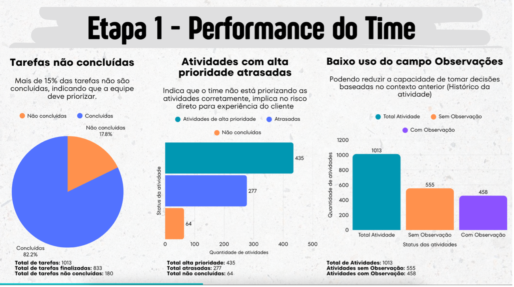
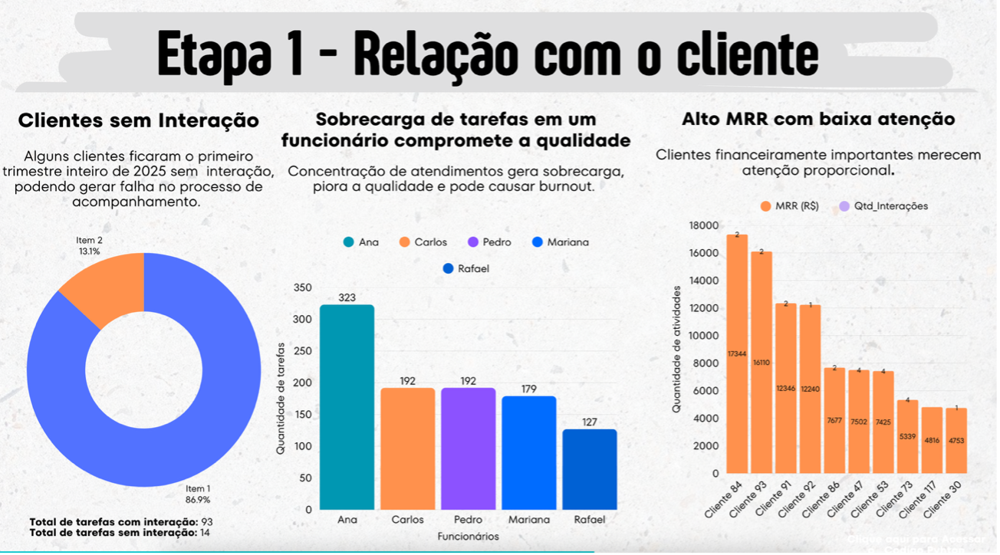
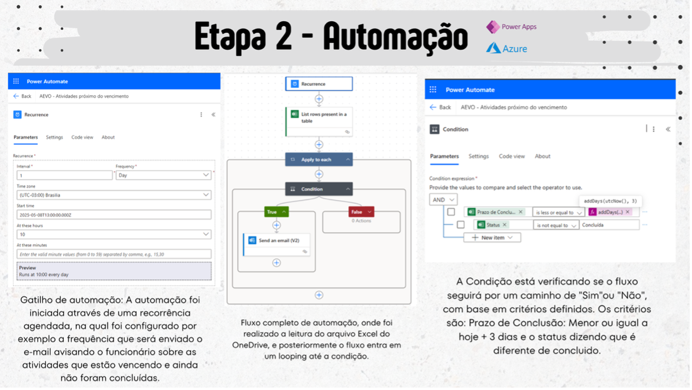
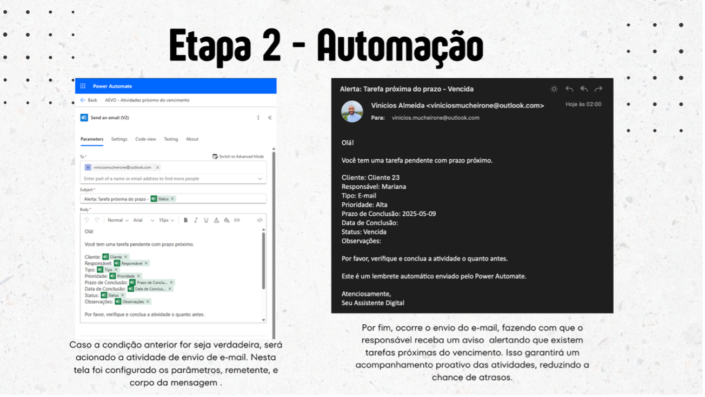

# 🚀 Sobre o projeto

Desenvolvi esse projeto para transformar registros de interações com clientes em insights acionáveis, ajudando na tomada de decisão na área de Sucesso do Cliente (Customer Success).  

Utilizei uma base de dados fictícia contendo atividades do 1º trimestre de 2025, com informações como responsável, cliente atendido, tipo de interação, prioridade, status da tarefa, data e observações.  

O trabalho envolveu:  
- Limpeza e padronização dos dados  
- Cruzamento com a tabela complementar **"Clientes"**, que inclui nome do cliente, responsável pela conta, MRR e fase da jornada  

Com isso, foi possível gerar análises e visualizações que facilitam a compreensão da operação e destacam oportunidades para melhorar o relacionamento com os clientes.

---

# 🛠️ Tecnologias utilizadas

- Jupyter Notebook  
- Python  
- pandas  
- matplotlib  
- Canvas  
- Portal Azure (Microsoft)  
- Power Automate  

---

# 🧩 Etapa 1 – Análise dos dados

Após tratar e limpar a base de dados, respondi às seguintes perguntas:

❓ **Pergunta 1:** Quais foram os principais insights sobre a performance do time?  
Identifiquei os pontos mais relevantes do desempenho da equipe, destacando oportunidades de melhoria e aspectos que merecem atenção para otimizar os resultados.

❓ **Pergunta 2:** Quais foram os principais insights sobre as reuniões e os contatos com os clientes?  
Analisei a frequência e a consistência das interações, buscando entender o relacionamento e apontar possíveis ajustes para fortalecê-lo.

# ⚙️ Etapa 2 – Lógica de Automação

Para aumentar a eficiência na área de Sucesso do Cliente, identifiquei que muitas atividades próximas do vencimento não recebiam acompanhamento proativo, o que causava atrasos e impactos negativos.

Proponho um fluxo de automação simples e prático que funciona assim:  

- **Gatilho:** a automação é acionada automaticamente quando uma tarefa está perto do prazo final.  
- **Condições:** verifica o status e a prioridade da tarefa para decidir se a automação deve prosseguir.  
- **Ação:** envia alertas ao responsável, garantindo acompanhamento próximo e evitando tarefas pendentes.

O objetivo é reduzir tarefas não concluídas por falta de monitoramento, simplificando a rotina da equipe com uma lógica clara e aplicável.

## ✅ Conclusão

Este projeto mostra como a análise de dados e automações simples podem melhorar a eficiência do time de Sucesso do Cliente, fortalecendo o relacionamento com clientes e ajudando empresas a tomarem decisões mais estratégicas e proativas.

 
